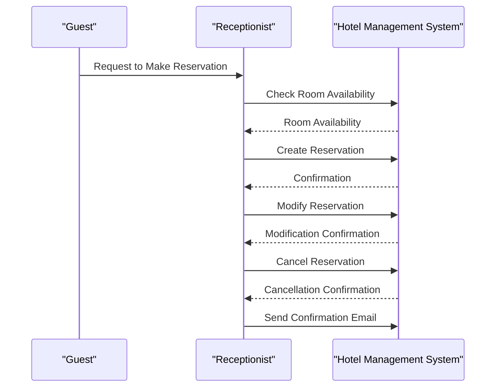

# Hotel Management Software - Software Requirements Specification (SRS)

## Table of Contents
1. Introduction
2. Purpose
3. Scope
4. System Overview
5. Functional Requirements
6. Non-Functional Requirements
7. User Interfaces
8. System Architecture
9. Data Management
10. Security and Access Control
11. Reporting and Analytics
12. External Interfaces
13. Performance Requirements
14. Maintenance and Support
15. Glossary
16. Appendices

## 1. Introduction
### 1.1 Purpose
The purpose of this document is to outline the requirements for the development of a Hotel Management Software system.

### 1.2 Scope
This system will cover reservation management, expense tracking, staff management, inventory and asset management, guest services, analytics, and mobile access for both guests and staff.

## 2. System Overview
Describe the high-level overview of the Hotel Management Software system.

## 3. Functional Requirements
### 3. Functional Requirements

#### FR-001: Reservation Management
- **Description:** The system should provide a user-friendly interface for managing room reservations.
- **Detailed Requirements:**
  1. Users must be able to check room availability for specific dates.
  2. Users should be able to make room reservations, including selecting room types and specifying the number of guests.
  3. The system should allow users to modify or cancel existing bookings.
  4. Confirmation emails should be sent to users upon successful reservations.
  5. Reservation records must include guest details, check-in, and check-out dates.

#### FR-002: Expense Tracking
- **Description:** The system should integrate with accounting software for expense management.
- **Detailed Requirements:**
  1. The system must support the categorization of expenses into predefined expense types (e.g., utilities, maintenance, payroll).
  2. Users should be able to input and track expenses, including the date, amount, and description.
  3. Expense reports must be generated, allowing users to view expenses within a specified time frame and by expense type.
  4. Integration with external accounting software should be seamless to ensure accurate financial records.
  5. The system must support the automatic calculation of total expenses.

#### FR-003: Staff Management
- **Description:** The system should provide tools for efficient staff management.
- **Detailed Requirements:**
  1. The system must support employee scheduling, allowing managers to create and update staff work schedules.
  2. Staff members should be able to clock in and out using the system, with attendance records automatically recorded.
  3. Role-based access control must be implemented to ensure data security and restrict access to sensitive information.
  4. Payroll processing functionality should calculate employee salaries based on worked hours and rates.
  5. Human resources (HR) functionalities, such as managing employee profiles and tracking leave requests, should be available.

(Continue with additional functional requirements as needed.)
### Functional Requirement: Reservation Management

```mermaid
@startuml
!define ReservationSystem <<System>>
!define User <<User>>

User --> (Make Reservation)
User --> (Modify Reservation)
User --> (Cancel Reservation)
(Make Reservation) --> (Check Room Availability)
(Make Reservation) --> (Select Room Type)
(Make Reservation) --> (Specify Guest Details)
(Modify Reservation) --> (View Existing Booking)
(Modify Reservation) --> (Update Booking Details)
(Cancel Reservation) --> (View Existing Booking)
(Cancel Reservation) --> (Confirm Cancellation)
ReservationSystem --> (Send Confirmation Email)
ReservationSystem --> (Record Reservation Details)

@enduml
```

# Hotel Management Software - Design Document

## Functional Requirement: Reservation Management (FR-001)

### Sequence Diagram


## 4. Non-Functional Requirements
List and describe the non-functional requirements of the system, including performance, security, and usability.

## 5. User Interfaces
Describe the user interfaces, including screenshots or wireframes if available.

## 6. System Architecture
Provide an overview of the system's architecture, including technologies used, databases, and APIs.

## 7. Data Management
Explain how data will be stored, accessed, and managed within the system.

## 8. Security and Access Control
Detail the security measures, authentication, and authorization mechanisms in place.

## 9. Reporting and Analytics
Describe the reporting and analytics features, including the types of reports and data visualizations.

## 10. External Interfaces
List any external systems, services, or APIs the software will interact with.

## 11. Performance Requirements
Specify the performance expectations, including response times and system scalability.

## 12. Maintenance and Support
Outline the plan for software maintenance, updates, and technical support.

## 13. Glossary
Include a glossary of terms used throughout the document.

## 14. Appendices
Include any additional information, diagrams, or documents relevant to the project.

---

This is a simplified SRS outline. Please work closely with your software development team to further refine and expand upon these requirements based on your specific needs and goals. Once you have finalized the SRS, it will serve as a foundation for your software development project.

If you have any specific details or changes you'd like to make to this SRS, please let me know, and I'll be happy to assist further.
